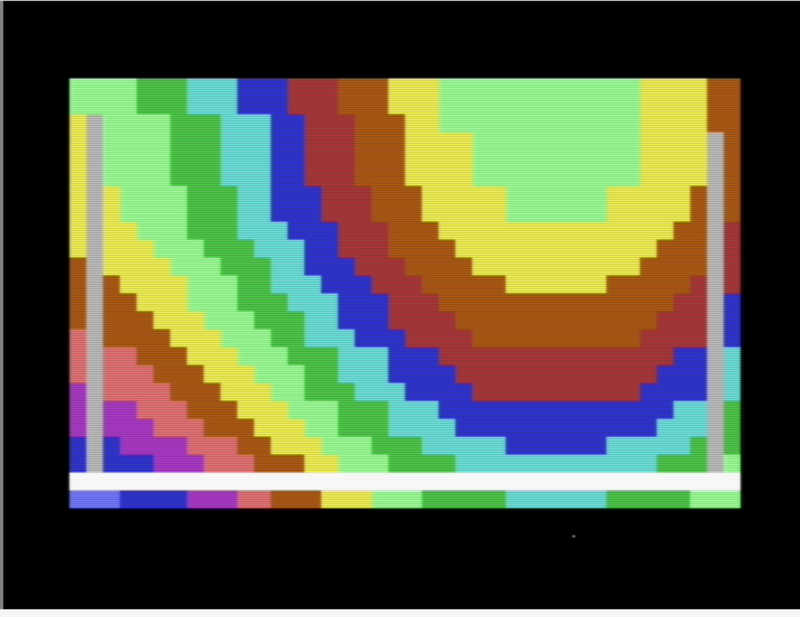
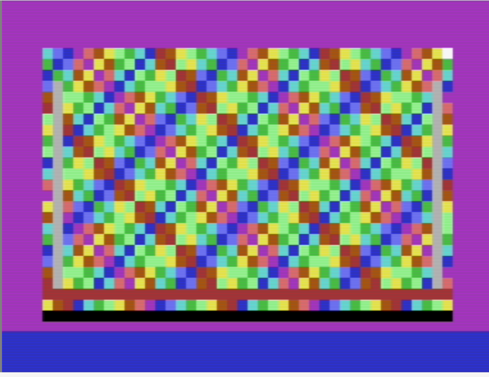
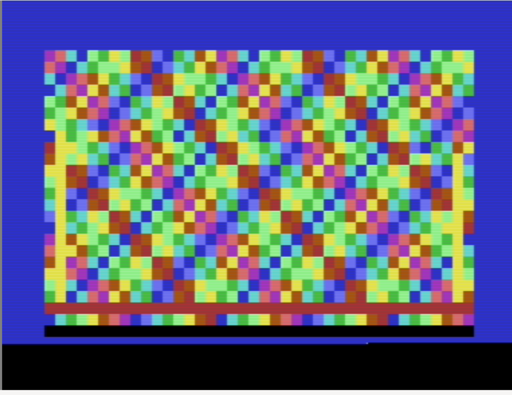

# Berlin Trip Subway 3SID

Berlin Trip Subway 3SID is a PAL Commodore 64 text-mode demo. It pairs 28
table-driven visual scenes with a three-chip SID arrangement: bass and sub on
SID1, melodic arpeggios on SID2, and drums on SID3. The project is deliberately
self-contained: ACME assembles one PRG, VICE runs it, and the repository tracks
the source, documentation, checksums, and preview captures needed to reproduce
the release.

## Contents

- [Quick start](#quick-start)
- [Running and sound configuration](#running-and-sound-configuration)
- [What happens at boot](#what-happens-at-boot)
- [Effect previews](#effect-previews)
- [Technical overview](#technical-overview)
- [Build, test, and package](#build-test-and-package)
- [Repository layout](#repository-layout)
- [Documentation and project status](#documentation-and-project-status)

## Quick start

Install [ACME](https://sourceforge.net/projects/acme-crossass/) and a VICE
build that provides `x64sc`, then run:

```sh
make build
make run
```

The compiled PRG is always written to
`build/berlin-trip-subway-3sid.prg`. Version numbers are reserved for release
archives, so local builds and emulator configuration never need a versioned
filename.

## Running and sound configuration

The demo uses these SID base addresses:

| Chip | Address | Role |
| --- | --- | --- |
| SID1 | `$d400` | Bass, sub, and supporting voices |
| SID2 | `$d420` | Arpeggio, harmony, and shimmer |
| SID3 | `$d440` | Kick, snare, and hi-hat drums |

`make run` launches VICE with the two extra SIDs configured at `$d420` and
`$d440`. A normal single-SID C64 can still display every effect, but it will
only produce SID1 audio. The demo targets PAL timing (50 Hz); use a PAL C64
model in an emulator or on hardware for the intended speed and synchronization.

If you load the PRG manually, start it with `RUN`. Its BASIC line executes
`SYS 2061`, which enters the fixed machine-code boot path described below.

## What happens at boot

The load address is `$0801`. The BASIC loader is intentionally tiny and stable:

```text
10 SYS 2061
    ↓
$080d BootStart: JMP MegaMain
    ↓
video setup → screen clear → 3SID music setup → scene 0 → raster IRQ
```

`BootStart` is a fixed trampoline. The source has an assembly-time assertion
that fails if the BASIC stub no longer ends at `$080d`; this prevents a harmless
text edit from silently breaking the `SYS 2061` target. `MegaMain` then installs
the PAL raster IRQ and enters the frame-driven main loop.

## Effect previews

### Verified boot-path capture

This VICE frame was captured after `RUN` reached `SYS 2061`, crossed the `$080d`
boot jump, and initialized the renderer.



### Pulse-field palette phases

These native VICE captures show two music-reactive phases of the opening
**3SID pulse field**. They are cropped to the C64 viewport; desktop and
emulator controls are not part of the assets.

| Magenta pulse phase | Blue pulse phase |
| --- | --- |
|  |  |

The opener chooses glyphs from `SafeTunnelChars` and derives its palette index
from cell position, the frame counter, and the three SID pulse values. The
geometry remains legible while its colour follows the music.

## Technical overview

- A single raster IRQ at line 250 is the 50 Hz master clock.
- The IRQ advances the music engine, derives audio-reactive values, and raises
  `frameReady` for the main loop.
- The main loop snapshots row and beat edges with interrupts briefly masked,
  preventing a heavier renderer from losing musical boundaries.
- `partId` selects matching initializer and update routines from dispatch
  tables. Every scene is timed in 16-row musical bars, fades from row 12, and
  changes at the following row 0.
- Effects write C64 text RAM at `$0400` and colour RAM at `$d800`; they do not
  require a bitmap mode or external art files at runtime.

The full execution map is in [docs/ARCHITECTURE.md](docs/ARCHITECTURE.md), and
the renderer-by-renderer description is in [docs/EFFECTS.md](docs/EFFECTS.md).

## Build, test, and package

| Command | Result |
| --- | --- |
| `make build` | Assemble `src/subway.s` into the canonical PRG. |
| `make run` | Build, then launch VICE with the required 3SID addresses. |
| `make check` | Rebuild and verify every tracked source/documentation checksum. |
| `make checksums` | Regenerate `CHECKSUMS.sha256` after an intentional tracked-file change. |
| `make release VERSION=6.0.2` | Create `dist/berlin-trip-subway-3sid-v6.0.2.zip`. |
| `make clean` | Remove generated `build/` and `dist/` directories. |

Run `make checksums` only when the changed files have been reviewed. `make
check` is the normal reproducibility gate: it assembles the source first, then
uses `shasum -a 256 -c CHECKSUMS.sha256` to validate the tracked project files.

## Repository layout

```text
src/subway.s                 Complete ACME source: boot, IRQ, music, effects, and data
assets/                      Cropped VICE captures used by this README
docs/ARCHITECTURE.md         Runtime flow, global routine map, memory/data contracts
docs/EFFECTS.md              Scene-by-scene implementation and visual behavior guide
Makefile                     Build, run, checksum, package, and cleanup targets
build_release.sh             Release wrapper around the Make targets
CHECKSUMS.sha256             SHA-256 manifest for tracked source and documentation
RELEASE_NOTES.md             User-facing release contents and running notes
AUDIT.md                     Cleanup, correction, and verification record
```

Generated output (`build/` and `dist/`) is excluded from version control.

## Documentation and project status

- [Effect guide](docs/EFFECTS.md): all 28 visual scenes, their data tables,
  timing inputs, and rendering behavior.
- [Architecture and source map](docs/ARCHITECTURE.md): startup path, IRQ/main
  loop contract, dispatch tables, global routines, and memory conventions.
- [Release notes](RELEASE_NOTES.md): packaged files, feature summary, and
  runtime configuration.
- [Audit record](AUDIT.md): repository normalization and verification work.
- [Music review](V6_0_0_MUSIC_AUDIT.json) and
  [arrangement notes](V6_0_0_NOTES.md): source-level music audit material.

The repository is intended to be publicly reproducible. Before publishing a
change, run `make check`, inspect the diff, regenerate checksums when required,
and include any new README asset in the release manifest.
